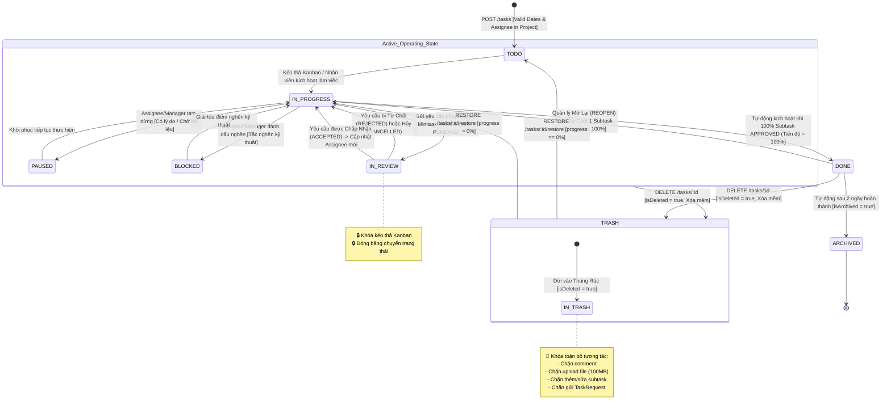
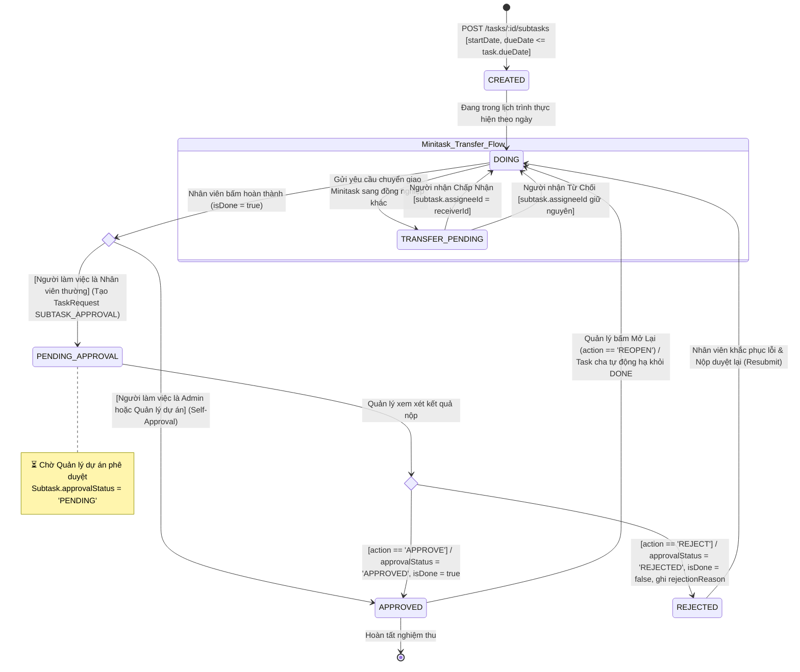
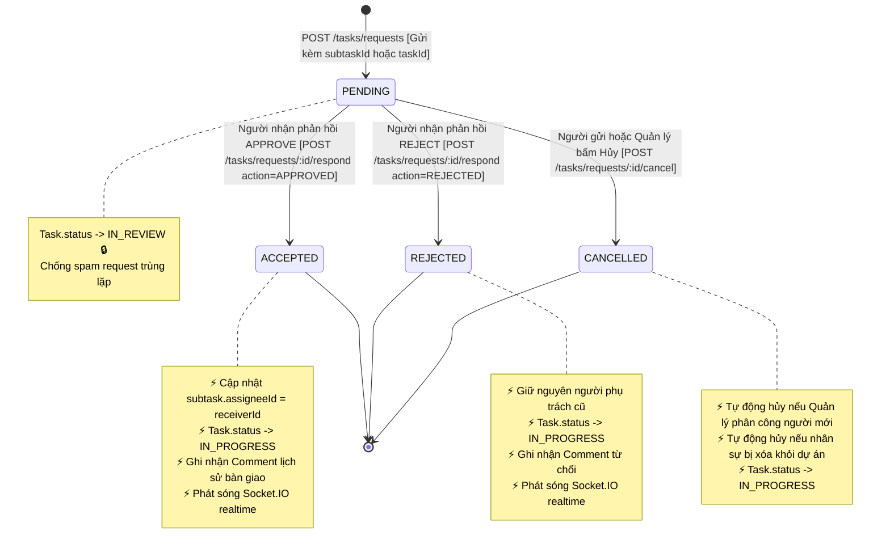
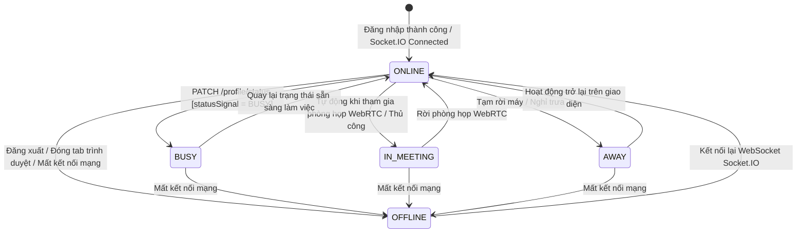
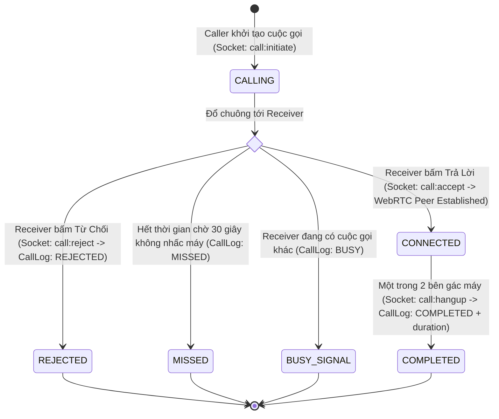

# 📊 06. SƠ ĐỒ THỰC THỂ CƠ SỞ DỮ LIỆU & BIỂU ĐỒ TRẠNG THÁI HỆ THỐNG (ERD & SYSTEM STATE CHARTS)

> **Tài liệu tham chiếu:** `docs/06_ERD_AND_SYSTEM_STATE_CHARTS.md`  
> **Phiên bản hệ thống:** `Solaris Task Board Manager v2.9.0 Enterprise Edition`  
> **Tiêu chuẩn biểu diễn:** UML 2.5 State Machine Specification & IDEF1X Data Modeling  
> **CSDL:** PostgreSQL 16 + Prisma ORM 7 (`@prisma/adapter-pg`)  
> **Động cơ thời gian thực:** Socket.IO WebSockets + WebRTC Gateway  

---

## 📑 MỤC LỤC TỔNG QUAN

1. [Sơ Đồ Thực Thể - Mối Quan Hệ CSDL Toàn Diện (Full Database ERD)](#1-sơ-đồ-thực-thể---mối-quan-hệ-csdl-toàn-diện-full-database-erd)
2. [Biểu Đồ Máy Trạng Thái Vòng Đời Task (Task Lifecycle UML State Machine)](#2-biểu-đồ-máy-trạng-thái-vòng-đời-task-task-lifecycle-uml-state-machine)
3. [Biểu Đồ Máy Trạng Thái Task Con / Minitask (Subtask State Machine & Approval Decision Tree)](#3-biểu-đồ-máy-trạng-thái-task-con--minitask-subtask-state-machine--approval-decision-tree)
4. [Biểu Đồ Máy Trạng Thái Yêu Cầu Chuyển Giao Minitask (TaskRequest State Machine)](#4-biểu-đồ-máy-trạng-thái-yêu-cầu-chuyển-giao-minitask-taskrequest-state-machine)
5. [Biểu Đồ Trạng Thái Tín Hiệu Người Dùng Realtime (User Status Signal State Chart)](#5-biểu-đồ-trạng-thái-tín-hiệu-người-dùng-realtime-user-status-signal-state-chart)
6. [Biểu Đồ Trạng Thái Cuộc Gọi WebRTC (WebRTC Audio/Video Call Session State Chart)](#6-biểu-đồ-trạng-thái-cuộc-gọi-webrtc-webrtc-audiovideo-call-session-state-chart)
7. [Tập Luật Bất Biến Toàn Vẹn Dữ Liệu Hệ Thống (System Invariant Integrity Constraints)](#7-tập-luật-bất-biến-toàn-vẹn-dữ-liệu-hệ-thống-system-invariant-integrity-constraints)
8. [Ma Trận Điều Kiện Chuyển Trạng Thái & Ràng Buộc Nghiệp Vụ (State Transition Matrix & Guards)](#8-ma-trận-điều-kiện-chuyển-trạng-thái--ràng-buộc-nghiệp-vụ-state-transition-matrix--guards)

---

## 1. SƠ ĐỒ THỰC THỂ - MỐI QUAN HỆ CSDL TOÀN DIỆN (FULL DATABASE ERD)

```mermaid
erDiagram
    DEPARTMENT ||--o{ USER : "thuộc phòng ban (1-N)"
    DEPARTMENT ||--o{ PROJECT_DEPARTMENT : "tham gia dự án (1-N)"
    PROJECT ||--o{ PROJECT_DEPARTMENT : "gán phòng ban (1-N)"
    
    USER ||--o{ PROJECT : "sở hữu / khởi tạo (ProjectOwner) (1-N)"
    USER ||--o{ PROJECT : "chỉ định quản lý (ProjectManager) (1-N)"
    USER ||--o{ PROJECT_MEMBER : "thành viên tham gia (1-N)"
    PROJECT ||--o{ PROJECT_MEMBER : "danh sách nhân sự (1-N)"
    
    PROJECT ||--o{ TASK : "chứa các công việc lớn (1-N)"
    USER ||--o{ TASK : "người khởi tạo (TaskCreator) (1-N)"
    USER ||--o{ TASK : "người phụ trách chính (TaskAssignee) (1-N)"
    
    TASK ||--o{ SUBTASK : "phân rã việc con theo ngày (1-N)"
    USER ||--o{ SUBTASK : "nhân sự thực hiện việc con (SubtaskAssignee) (1-N)"
    
    PROJECT ||--o{ TAG : "danh mục nhãn theo dự án (1-N)"
    TASK ||--o{ TASK_TAG : "liên kết nhãn (1-N)"
    TAG ||--o{ TASK_TAG : "gán vào task (1-N)"
    
    TASK ||--o{ COMMENT : "trao đổi tác nghiệp (1-N)"
    USER ||--o{ COMMENT : "tác giả bình luận (1-N)"
    
    TASK ||--o{ ATTACHMENT : "tệp tin đính kèm (<=100MB) (1-N)"
    
    TASK ||--o{ TASK_REQUEST : "yêu cầu chuyển giao / duyệt (1-N)"
    USER ||--o{ TASK_REQUEST : "người gửi yêu cầu (Sender) (1-N)"
    USER ||--o{ TASK_REQUEST : "người nhận yêu cầu (Receiver) (1-N)"
    
    USER ||--o{ DIRECT_MESSAGE : "gửi tin nhắn 1-1 (Sender) (1-N)"
    USER ||--o{ DIRECT_MESSAGE : "nhận tin nhắn 1-1 (Receiver) (1-N)"
    
    USER ||--o{ CALL_LOG : "người khởi tạo cuộc gọi (Caller) (1-N)"
    USER ||--o{ CALL_LOG : "người nhận cuộc gọi (Receiver) (1-N)"
    
    USER ||--o{ AUDIT_LOG : "lịch sử kiểm toán hệ thống (1-N)"
    
    USER ||--o{ NOTIFICATION : "nhận thông báo cá nhân (1-N)"
    USER ||--o{ NOTIFICATION : "tác nhân gây ra (Actor) (1-N)"
    TASK ||--o{ NOTIFICATION : "gắn liền với task (1-N)"

    DEPARTMENT {
        string id PK "UUID"
        string name UK "Tên phòng ban độc nhất"
        string code UK "Mã định danh phòng ban"
        string description "Mô tả chức năng"
        datetime created_at "Thời điểm tạo"
        datetime updated_at "Thời điểm cập nhật"
    }

    USER {
        string id PK "UUID"
        string email UK "Email đăng nhập"
        string password "Mã băm mật khẩu Bcrypt 10 rounds"
        string full_name "Họ và tên"
        string avatar "URL ảnh đại diện"
        string cover_image "URL ảnh bìa vũ trụ"
        string google_id UK "Google OAuth2 ID"
        enum role "ADMIN | MANAGER | EMPLOYEE"
        enum profession "DEV | TESTER | DESIGNER | BA | MARKETING | DEVOPS | PRODUCT_OWNER"
        string job_title "Chức danh công việc"
        string phone "Số điện thoại liên hệ"
        string bio "Tiểu sử / Phương châm"
        enum status_signal "ONLINE | BUSY | IN_MEETING | AWAY | OFFLINE"
        string custom_status "Câu trạng thái tùy chỉnh"
        string refresh_token "Mã băm Refresh Token (7 ngày)"
        string department_id FK "Phòng ban trực thuộc"
        datetime created_at "Thời điểm tạo"
        datetime updated_at "Thời điểm cập nhật"
    }

    PROJECT {
        string id PK "UUID"
        string name "Tên dự án"
        string description "Mô tả mục tiêu dự án"
        boolean is_completed "Đã đóng / Nghiệm thu xong"
        string manager_id FK "Quản lý phụ trách dự án"
        string created_by_id FK "Người khởi tạo dự án"
        string stages_json "Danh sách quy trình Pipeline (JSON)"
        datetime created_at "Thời điểm tạo"
        datetime updated_at "Thời điểm cập nhật"
    }

    PROJECT_MEMBER {
        string project_id PK,FK "Mã dự án"
        string user_id PK,FK "Mã nhân sự"
        datetime joined_at "Thời điểm gia nhập"
    }

    PROJECT_DEPARTMENT {
        string project_id PK,FK "Mã dự án"
        string department_id PK,FK "Mã phòng ban"
    }

    TASK {
        string id PK "UUID"
        string title "Tiêu đề Task"
        string description "Mô tả nội dung chi tiết"
        enum status "TODO | IN_PROGRESS | PAUSED | BLOCKED | IN_REVIEW | DONE"
        enum priority "LOW | NORMAL | IMPORTANT | URGENT"
        int progress "Tiến độ động 0 - 100%"
        datetime start_date "Ngày bắt đầu tác nghiệp"
        datetime due_date "Hạn chót hoàn tất tổng"
        string recurrence_rule "Quy tắc lặp định kỳ (RRULE)"
        boolean is_archived "Đã lưu trữ vào kho"
        boolean is_deleted "Xóa mềm vào thùng rác"
        datetime deleted_at "Thời điểm đưa vào thùng rác"
        datetime completed_at "Thời điểm đạt 100% hoàn thành"
        string project_id FK "Dự án trực thuộc"
        string assignee_id FK "Người chịu trách nhiệm chính"
        string created_by_id FK "Người tạo Task"
        string stage_id "Giai đoạn Pipeline hiện tại"
        datetime created_at "Thời điểm tạo"
        datetime updated_at "Thời điểm cập nhật"
    }

    SUBTASK {
        string id PK "UUID"
        string task_id FK "Task cha trực thuộc"
        string title "Tiêu đề việc con"
        boolean is_done "Trạng thái đã hoàn tất"
        boolean is_urgent "Đánh dấu khẩn cấp"
        string approval_status "NONE | PENDING | APPROVED | REJECTED"
        string rejection_reason "Lý do từ chối nghiệm thu"
        int order "Thứ tự sắp xếp dòng thời gian"
        string assignee_id FK "Người thực hiện việc con riêng biệt"
        datetime start_date "Ngày bắt đầu việc con"
        int estimated_days "Trọng số ngày công (ước lượng >= 1)"
        datetime due_date "Hạn chót việc con (<= task.dueDate)"
        datetime created_at "Thời điểm tạo"
        datetime updated_at "Thời điểm cập nhật"
    }

    TAG {
        string id PK "UUID"
        string name "Tên thẻ nhãn"
        string color "Mã màu thẻ nhãn"
        string project_id FK "Dự án sở hữu thẻ"
        datetime created_at "Thời điểm tạo"
    }

    TASK_TAG {
        string task_id PK,FK "Mã Task"
        string tag_id PK,FK "Mã Tag"
    }

    COMMENT {
        string id PK "UUID"
        string content "Nội dung bình luận đã trim (Not Empty)"
        string task_id FK "Task được bình luận"
        string user_id FK "Tác giả bình luận"
        datetime created_at "Thời điểm bình luận"
        datetime updated_at "Thời điểm chỉnh sửa"
    }

    ATTACHMENT {
        string id PK "UUID"
        string name "Tên gốc tệp tin"
        string url "Đường dẫn lưu an toàn (/uploads/...)"
        string type "file | link"
        string size "Dung lượng tệp (tối đa 100MB)"
        string task_id FK "Task chứa tệp đính kèm"
        datetime created_at "Thời điểm tải lên"
    }

    TASK_REQUEST {
        string id PK "UUID"
        string task_id FK "Task cha liên quan"
        string sender_id FK "Người gửi yêu cầu"
        string receiver_id FK "Người nhận yêu cầu"
        enum type "TRANSFER | ASSIST | REVIEW | SUBTASK_APPROVAL"
        enum status "PENDING | ACCEPTED | REJECTED | CANCELLED"
        string note "Ghi chú yêu cầu / SubtaskId liên quan"
        string response_note "Phản hồi phê duyệt hoặc lý do từ chối"
        datetime created_at "Thời điểm gửi"
        datetime updated_at "Thời điểm phản hồi"
    }

    DIRECT_MESSAGE {
        string id PK "UUID"
        string content "Nội dung tin nhắn trò chuyện"
        string sender_id FK "Người gửi"
        string receiver_id FK "Người nhận"
        boolean is_read "Đã xem tin nhắn"
        datetime created_at "Thời điểm gửi"
    }

    CALL_LOG {
        string id PK "UUID"
        string caller_id FK "Người khởi tạo cuộc gọi"
        string receiver_id FK "Người nhận cuộc gọi"
        enum type "AUDIO | VIDEO"
        enum status "MISSED | COMPLETED | REJECTED | BUSY"
        int duration "Thời lượng thoại (giây)"
        datetime started_at "Thời điểm bắt đầu chuông"
        datetime ended_at "Thời điểm ngắt kết nối"
    }

    AUDIT_LOG {
        string id PK "UUID"
        string action "CREATE | UPDATE | DELETE | TRANSFER | APPROVE"
        string entity_name "Tên bảng dữ liệu"
        string entity_id "ID bản ghi chịu tác động"
        json old_values "Trạng thái dữ liệu cũ"
        json new_values "Trạng thái dữ liệu mới"
        string user_id FK "Người thực thi thao tác"
        datetime created_at "Thời điểm ghi nhận kiểm toán"
    }

    NOTIFICATION {
        string id PK "UUID"
        string user_id FK "Người nhận thông báo"
        string actor_id FK "Người gây ra hành động (Actor)"
        string title "Tiêu đề thông báo"
        string content "Nội dung chi tiết thông báo"
        enum type "TASK_ASSIGNED | SUBTASK_URGENT | SUBTASK_APPROVAL_REQUEST | SUBTASK_APPROVED | SUBTASK_REJECTED | TASK_TRANSFER_REQUEST | TASK_COMMENT | SYSTEM"
        string task_id FK "Task liên quan"
        string subtask_id "Subtask liên quan"
        string project_id "Project liên quan"
        boolean is_read "Đã xem thông báo"
        datetime created_at "Thời điểm phát sinh thông báo"
    }
```

---

## 2. BIỂU ĐỒ MÁY TRẠNG THÁI VÒNG ĐỜI TASK (TASK LIFECYCLE UML STATE MACHINE)

---

## 3. BIỂU ĐỒ MÁY TRẠNG THÁI TASK CON / MINITASK (SUBTASK STATE MACHINE & APPROVAL DECISION TREE)

---

## 4. BIỂU ĐỒ MÁY TRẠNG THÁI YÊU CẦU CHUYỂN GIAO MINITASK (TASKREQUEST STATE MACHINE)

---

## 5. BIỂU ĐỒ TRẠNG THÁI TÍN HIỆU NGƯỜI DÙNG REALTIME (USER STATUS SIGNAL STATE CHART)

---

## 6. BIỂU ĐỒ TRẠNG THÁI CUỘC GỌI WEBRTC (WEBRTC AUDIO/VIDEO CALL SESSION STATE CHART)

---

## 7. TẬP LUẬT BẤT BIẾN TOÀN VẸN DỮ LIỆU HỆ THỐNG (SYSTEM INVARIANT INTEGRITY CONSTRAINTS)

Các định lý bất biến (Invariants) sau được bảo vệ cưỡng chế 100% qua Database Constraints và Backend Services:

$$\forall T \in \text{Tasks}: \text{Progress}(T) = \begin{cases} 100\% & \text{khi } \text{Count}(\text{Subtasks}) = 0 \text{ và } T.\text{status} = \text{DONE} \\ 0\% & \text{khi } \sum \text{estimatedDays} = 0 \\ \left\lfloor \frac{\sum_{s \in S_{\text{approved}}} s.\text{estimatedDays}}{\sum_{s \in S_{\text{all}}} s.\text{estimatedDays}} \times 100 \right\rfloor & \text{trường hợp còn lại} \end{cases}$$

$$\forall T \in \text{Tasks}: T.\text{status} = \text{DONE} \iff \text{Progress}(T) = 100\% \land \forall s \in T.\text{Subtasks} : (s.\text{isDone} = \text{true} \land s.\text{approvalStatus} = \text{'APPROVED'})$$

$$\forall s \in \text{Subtasks}: T.\text{startDate} \le s.\text{startDate} \le s.\text{dueDate} \le T.\text{dueDate}$$

$$\forall A \in \text{Attachments}: A.\text{size} \le 100\text{MB} \land A.\text{name} = \text{SanitizeFilename}(A.\text{name})$$

$$\forall T \in \text{Tasks}: T.\text{isDeleted} = \text{true} \implies \text{MutationsBlocked}(T) = \text{true} \quad (\text{Chặn Comment, Attachment, Subtask, Request})$$

$$\forall R \in \text{TaskRequests}: R.\text{status} = \text{'PENDING'} \implies T.\text{status} = \text{'IN\_REVIEW'} \quad (\text{Khóa kéo thả Kanban})$$

---

## 8. MA TRẬN ĐIỀU KIỆN CHUYỂN TRẠNG THÁI & RÀNG BUỘC NGHIỆP VỤ (STATE TRANSITION MATRIX & GUARDS)

| Thực Thể | Trạng Thái Hiện Tại | Trạng Thái Đích | Điều Kiện Chặn (Guard Conditions) & Hành Động Kích Hoạt Tự Động |
| :--- | :---: | :---: | :--- |
| **Task** | `TODO` / `IN_PROGRESS` | `DONE` | 🔒 **Ràng buộc:** Bắt buộc 100% Subtask đã được phê duyệt (`isDone: true, approvalStatus = 'APPROVED'`). Tiến độ đạt 100%. Tự động ghi `completedAt = now()`. |
| **Task** | `DONE` | `IN_PROGRESS` | ⚡ **Kích hoạt:** Khi Quản lý mở lại (`REOPEN`) hoặc từ chối (`REJECT`) 1 Subtask, Task cha tự động hạ về `IN_PROGRESS` và xóa `completedAt = null`. |
| **Task** | Bất kỳ | `IN_REVIEW` | 🔒 **Khóa kéo thả:** Tự động chuyển khi có yêu cầu chuyển giao (`TaskRequest: PENDING`). Khóa cứng không cho kéo thả Kanban cho đến khi request được xử lý. |
| **Task** | `PAUSED` / `BLOCKED` | Chỉnh sửa | 🔒 **Đóng băng:** Chặn sửa mô tả, chặn nộp duyệt subtask, chặn gửi yêu cầu chuyển giao. Chỉ Admin/Manager mới có quyền khôi phục trạng thái. |
| **Subtask** | `DOING` | `PENDING_APPROVAL` | 🛡️ **Kiểm soát:** Chỉ người được gán Subtask (`subtask.assigneeId === user.id`) mới có quyền bấm hoàn thành gửi Quản lý duyệt. |
| **Subtask** | `DOING` | `APPROVED` | 👑 **Self-Approval:** Nếu người làm Task là Admin hoặc Quản lý dự án, hệ thống tự động duyệt ngay không cần qua hộp thư phê duyệt. |
| **Subtask** | `APPROVED` | Sửa đổi / Xóa | 🔒 **Bảo vệ:** Khóa cứng không cho nhân viên sửa nội dung, số ngày hoặc xóa Subtask đã nghiệm thu. Chỉ Quản lý mới có quyền xóa. |
| **TaskRequest** | `PENDING` | `ACCEPTED` | 🔀 **Chuyển giao Minitask:** Cập nhật `subtask.assigneeId = receiverId`, tự động khôi phục Task cha về `IN_PROGRESS` và phát sóng Socket.IO realtime. |
| **Tệp tin (Attachment)** | Tải lên (`POST`) | Thành công | 📂 **Giới hạn 100MB:** Dung lượng file tối đa 100MB, làm sạch tên file an toàn, lưu tại `/uploads/`, khóa tải lên Task đã xóa vào thùng rác. |
| **Thùng rác (Trash)** | `isDeleted: true` | Bất kỳ thao tác | 🚫 **Khóa triệt để:** Chặn bình luận, chặn tải file, chặn thêm subtask, chặn gửi request đối với Task đang ở trong thùng rác. |
