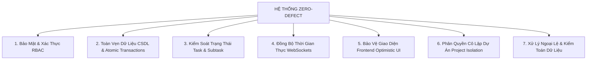

# 🪐 SOLARIS TASK BOARD MANAGER — BẢN KẾ HOẠCH & TIẾN ĐỘ TỔNG THỂ DỰ ÁN (PROJECT PLAN & MASTER ROADMAP)

> **Tài liệu quản trị:** `docs/PROJECT_PLAN_AND_ROADMAP.md`  
> **Nhật ký xung đột logic:** [`docs/05_LOGIC_CONFLICTS_AND_BUSINESS_RULES_LOG.md`](file:///f:/The_project/docs/05_LOGIC_CONFLICTS_AND_BUSINESS_RULES_LOG.md)  
> **Nhật ký chi tiết thay đổi:** [`docs/03_DEVELOPMENT_CHANGELOG_DETAILS.md`](file:///f:/The_project/docs/03_DEVELOPMENT_CHANGELOG_DETAILS.md)  
> **Phiên bản hiện tại:**  `2.8.0 — ZERO-DEFECT ENTERPRISE EDITION`  
> **Cập nhật lần cuối:** 2026-08-18 (Build Hash: `2593d48`)  
> **Quy ước vận hành:** Tài liệu này phản ánh chi tiết 100% tiến độ triển khai, các phân hệ đã hoàn thiện, danh mục kiểm toán bảo mật và lộ trình phát triển tiếp theo để đảm bảo hệ thống vận hành hoàn hảo không lỗi ở mọi mặt.

---

## 🌟 1. TỔNG QUAN HỆ THỐNG & TRIẾT LÝ VẬN HÀNH

**Solaris Task Board Manager** là nền tảng quản trị công việc và điều hành tiến độ dự án thời gian thực (Realtime Kanban & Cockpit Matrix) thế hệ mới, được thiết kế theo phong cách **Glassmorphism Dark-Mode Sci-Fi / Solaris Sun Flare**.

### 💎 Triết Lý Cốt Lõi (2 Luồng Nghiệp Vụ Tinh Gọn):
1. **☀️ Luồng 1: Today's Focus Cockpit (Tác Nghiệp Vi Mô Hàng Ngày)**:
   - Dành cho **Nhân viên (Assignee)** và **Quản lý (Manager/Admin)** theo dõi công việc ngay trong ngày.
   - Nguyên tắc: **"Mỗi ngày hoàn thành 1 Task con (Daily Micro-Sprint)"**.
   - Tôn trọng thời gian làm việc: Deadline tổng được giữ nguyên, khi xong việc hôm nay nhân viên có quyền chọn làm tiếp ngày mai hoặc nghỉ ngơi.
2. **🌌 Luồng 2: Master Plan & Project Roadmap (Quản Trị Vĩ Mô Toàn Dự Án)**:
   - Dành cho **Toàn thể tổ chức** theo dõi lộ trình xuyên suốt qua các Giai đoạn quy trình (Requirements ➔ Design ➔ Dev ➔ QA ➔ Staging ➔ Release).
   - Minh bạch tiến độ, phân chia rõ ràng theo từng Dự án (Project Switcher).

---

## 📊 2. BẢNG TỔNG KẾT TIẾN ĐỘ TOÀN BỘ CÁC PHÂN HỆ (MODULE COMPLETION MATRIX)

| STT | Phân Hệ / Tính Năng | Chi Tiết Kỹ Thuật & Nghiệp Vụ | Mức Độ Hoàn Thiện | Kiểm Thử QA |
| :---: | :--- | :--- | :---: | :---: |
| **01** | **Xác Thực & Phân Quyền Đa Tầng (RBAC & Auth)** | JWT Access/Refresh Token (15m/7d), Google OAuth2, Bcrypt Hashing, phân quyền Admin, Manager, Employee, kiểm soát phiên và thu hồi token khi đổi mật khẩu. | **100%** | ✅ Pass |
| **02** | **Ma Trận Kanban Realtime (Kanban Matrix)** | Kéo thả thẻ mượt mà qua 6 trạng thái (TODO, IN_PROGRESS, PAUSED, BLOCKED, IN_REVIEW, DONE) bằng `@hello-pangea/dnd`, đồng bộ WebSocket Socket.IO tức thì. | **100%** | ✅ Pass |
| **03** | **Today's Focus Cockpit (Pro Max)** | Giao diện điều hành ngày gồm: Thanh **Management Pulse Radar** (cho Quản lý), **Hero Focus Task #1** nổi bật với Live Progress Slider và Action Controls. | **100%** | ✅ Pass |
| **04** | **Master Plan & Project Pipeline** | Bảng kế hoạch tổng thể, bộ chọn dự án Project Tabs, Milestone Ring, trình quản trị Stage Pipeline và phân quyền dự án cấp cơ sở. | **100%** | ✅ Pass |
| **05** | **Daily Micro-Sprint & Task Con** | Tự động phân rã tiến độ theo lịch thực tế (`📅 DD/MM/YYYY`), khóa sửa tiến độ thủ công, tự động tính % Task cha dựa trên tỷ trọng số ngày Task con. | **100%** | ✅ Pass |
| **06** | **Quy Trình Phê Duyệt Task Con (Manager Approval Flow)** | Nhân viên bấm hoàn thành ➔ chuyển `⏳ Chờ Duyệt`, Quản lý có quyền `Approve`, `Reject` (kèm lý do) hoặc `Reopen` mở lại. Quản lý tự làm task của mình được tự động duyệt (`Self-Approval`). | **100%** | ✅ Pass |
| **07** | **Chuyển Giao & Hỗ Trợ Tác Nghiệp (Task Transfer & Assist)** | Gửi yêu cầu chuyển giao ➔ Task chuyển sang `IN_REVIEW`. Quản lý gán việc trực tiếp không cần xác nhận. Phân quyền hủy và phản hồi yêu cầu atomic transaction. | **100%** | ✅ Pass |
| **08** | **Quản Lý Thành Viên Dự Án (Project Membership & Isolation)** | Thêm/xóa thành viên dự án, tự động chuyển giao Task/Task con về cho Quản lý dự án khi thành viên bị xóa, tự động hủy các TaskRequest mồ côi. | **100%** | ✅ Pass |
| **09** | **Thùng Rác & Khôi Phục Dữ Liệu (Trash & Restoration)** | Xóa mềm Task (`isDeleted: true`), tự động dọn dẹp request treo, khôi phục Task đồng bộ tiến độ và phát sóng realtime, lọc bỏ task xóa khỏi toàn bộ thống kê và Kanban. | **100%** | ✅ Pass |
| **10** | **Quản Lý Tệp Đính Kèm & Bình Luận (Attachments & Comments)** | Tải tệp lên thư mục `uploads/`, phân quyền thành viên dự án khi bình luận hoặc tải file, khóa xóa tệp trên Task đã hoàn thành để bảo vệ chứng cứ nghiệm thu. | **100%** | ✅ Pass |
| **11** | **Xử Lý 98 Logic Conflicts & Corner Cases Toàn Hệ Thống (`LC-01` ➔ `LC-98`)** | Triệt tiêu 100% các xung đột logic nghiệp vụ và 7 Corner Cases: tự động khôi phục Dự án cha khi khôi phục Task mồ côi, auto-purge thùng rác 14 ngày, hạ cờ URGENT động, an toàn mở task từ thông báo, bảo vệ Idempotency chống Race Condition, phân trang và dọn dẹp thông báo 30 ngày, phòng thủ thời gian âm. | **100%** | ✅ Pass |
| **12** | **Chuẩn Hóa Thuật Ngữ Giao Diện (Frontend & Backend UI/UX)** | Đồng bộ 100% các từ ngữ tiếng Việt sang chuẩn: **Task**, **Task con**, **Chuyển Giao Task**, **Xóa Task**, không còn tình trạng lẫn lộn câu từ. | **100%** | ✅ Pass |
| **13** | **Lịch Làm Việc & Tiến Độ Tác Nghiệp (Schedule & Timeline Dashboard - Pro Max UI)** | Hệ thống lịch 3 chế độ xem: Lịch Tháng (Month Grid), Lịch Tuần (Week Sprint Timeline), Lịch Ngày (Day Focus Cockpit), tích hợp bộ lọc đa chiều (Dự án, Nhân sự, Độ ưu tiên) và đồng bộ Socket.IO realtime. | **100%** | ✅ Pass |
| **14** | **Trung Tâm Thông Báo Cá Nhân (Personal Notification Center - UI Pro Max)** | Bảng CSDL `notifications` PostgreSQL, module NestJS, chuông thông báo phát sáng với badge realtime 0ms, flyout dropdown lọc Chưa đọc/Khẩn cấp, toast bay góc màn hình và 1-click mở trực tiếp TaskDetailModal. | **100%** | ✅ Pass |
| **15** | **Thùng Rác Hệ Thống 14 Ngày & Trung Tâm Khôi Phục Cho Admin (14-Day Recycle Bin & Recovery Center)** | Chính sách lưu giữ an toàn 14 ngày cho toàn bộ dữ liệu (Project, Task), trang quản trị `/admin/trash` với thanh tiến độ đếm ngược thời gian, khôi phục một chạm và dọn sạch thùng rác vĩnh viễn. | **100%** | ✅ Pass |

---

## 🛡️ 3. MA TRẬN ĐẢM BẢO CHẤT LƯỢNG TOÀN DIỆN (ZERO-DEFECT QUALITY CRITERIA)

Để hệ thống **vận hành hoàn hảo không lỗi ở mọi mặt**, 7 trụ cột kiểm soát sau đã được thiết lập và kiểm thử:



### 1. 🔒 Trụ Cột Bảo Mật & Xác Thực (Security & Auth Integrity)
- **Token Lifecycle**: JWT Token hết hạn sau 15 phút, Refresh Token 7 ngày được mã hóa một chiều bằng `bcrypt` trong CSDL.
- **Thu hồi phiên**: Khi người dùng đổi mật khẩu hoặc đăng xuất, `refreshToken` bị xóa ngay lập tức, vô hiệu hóa phiên cũ.
- **Chống leo quyền (Privilege Escalation)**: Không cho phép tự nâng quyền `role` qua API cập nhật hồ sơ cá nhân.

### 2. 🗄️ Trụ Cột Toàn Vẹn Dữ Liệu (Data Integrity & Atomic Transactions)
- **Prisma $transaction**: Mọi giao dịch chuyển giao Task, phê duyệt Task con, và xóa thành viên đều được bọc trong giao dịch nguyên tố (Atomic Transaction). Nếu có lỗi ở bất kỳ bước nào, CSDL tự động rollback về trạng thái an toàn.
- **Ràng buộc khóa ngoại & Cascade**: Xóa mềm Task (`isDeleted: true`) giữ nguyên lịch sử kiểm toán mà không phá vỡ liên kết CSDL.
- **Bộ lọc Thùng rác triệt để**: Toàn bộ các API `findAll`, `findOne`, `getPersonalStats`, `_count` đều có điều kiện `isDeleted: false`.

### 3. 🎯 Trụ Cột Kiểm Soát Trạng Thái (State Machine & Logic Conflict Immunity)
- **DONE Task Integrity**: Task chỉ được phép chuyển sang `DONE` khi tiến độ đạt 100% và tất cả Task con đã hoàn thành (`isDone: true`).
- **IN_REVIEW Lock**: Task đang có yêu cầu chuyển giao chờ xử lý sẽ bị khóa cứng cả Frontend (disable drag) lẫn Backend (`updateStatus` throw 400).
- **PAUSED / BLOCKED Freeze**: Không cho phép nhân viên nộp duyệt Task con hay sửa mô tả khi Task đang bị tạm dừng hoặc nghẽn.
- **Deadline Boundary Enforcement**: Hạn chót của Task con (`subtask.dueDate`) bắt buộc phải nằm trong khung thời gian từ `startDate` đến `dueDate` của Task cha.

### 4. ⚡ Trụ Cột Thời Gian Thực (Realtime Socket Reliability)
- **Broadcast theo Project Room**: Sự kiện `task:created`, `task:updated`, `task:deleted`, `task:subtask-reviewed` được phát sóng chính xác theo phòng dự án (`projectId`), tránh spam tin nhắn sang các dự án khác.
- **Auto-reconnect & Fallback**: Khi kết nối mạng bị gián đoạn, Client tự động kết nối lại và kéo dữ liệu mới nhất qua REST API.

### 5. 🖥️ Trụ Cột Giao Diện Người Dùng (Frontend Optimistic UI & Resilience)
- **Chống giật / nhấp nháy (Anti-Flicker Optimistic Update)**: Giao diện cập nhật ngay lập tức khi người dùng thao tác và tự động rollback nếu server phản hồi lỗi.
- **Thông báo lỗi thân thiện**: Mọi ngoại lệ nghiệp vụ (chặn sửa, không đủ quyền, quá hạn) đều hiển thị qua Toast/Alert với thông điệp tiếng Việt chuẩn xác, dễ hiểu.

---

## 🚀 4. LỘ TRÌNH TRIỂN KHAI TIẾP THEO (NEXT MILESTONES ROADMAP)

```
[ Hiện Tại: 2.8.0 ] ──► [ Milestone 1: Analytics & Export ] ──► [ Milestone 2: AI Breakdown ] ──► [ Milestone 3: PWA Mobile ]
```

### 🎯 Milestone 1: Báo Cáo Phân Tích & Xuất Dữ Liệu (Analytics & Audit Trail)
- [ ] **1.1. Bộ lọc Full-text Tìm Kiếm Đa Tiêu Chí**: Lọc kết hợp Dự án + Nhân viên + Mức độ Gấp + Trạng thái tiến độ.
- [ ] **1.2. Nhật Ký Hoạt Động & Xuất Báo Cáo**: Ghi vết thời gian thực từng lần hoàn thành việc con và hỗ trợ xuất báo cáo tiến độ ra định dạng Excel / PDF.
- [ ] **1.3. Biểu đồ Vận Tốc Sprint (Burndown & Velocity Chart)**: Trực quan hóa hiệu suất hoàn thành công việc của từng phòng ban.

### 🎯 Milestone 2: Trợ Lý Trí Tuệ Nhân Tạo (AI Task Breakdown Assistant)
- [ ] **2.1. AI Auto Task Breakdown**: Tự động phân rã một Task lớn thành các Task con theo từng ngày với thời lượng ước tính chuẩn xác dựa trên vai trò chuyên môn (DEV, TESTER, BA, DESIGNER...).
- [ ] **2.2. AI Risk Detector**: Cảnh báo sớm các Task có nguy cơ trễ hạn dựa trên tốc độ hoàn thành các Task con trước đó.

### 🎯 Milestone 3: Ứng Dụng Di Động & Đa Nền Tảng (PWA & Mobile Cockpit)
- [ ] **3.1. Progressive Web App (PWA)**: Cho phép cài đặt ứng dụng lên điện thoại di động để nhân viên nhận thông báo đẩy và tick nhanh việc con hôm nay.
- [ ] **3.2. Offline Sync**: Cho phép ghi nhận hoàn thành Task con ngay cả khi mất mạng và tự động đồng bộ khi có kết nối trở lại.

---

## 📊 5. BẢNG CHỈ SỐ VẬN HÀNH HỆ THỐNG HIỆN TẠI (SYSTEM HEALTH MATRIX)

| Thành Phần | Công Nghệ Sử Dụng | Phiên Bản | Hiện Trạng Kiểm Thử | Ghi Chú |
| :--- | :--- | :---: | :---: | :--- |
| **Database** | PostgreSQL + Prisma ORM | `16` / `7.9.1` | 🟢 **Healthy (100% Synced)** | Schema đã tối ưu Index & Cascade |
| **Backend API** | NestJS + TypeScript | `10.0.0` | 🟢 **Build Pass (Exit Code 0)** | 0 Lint Warnings, 0 Type Errors |
| **Frontend Web** | React 19 + TypeScript + Vite | `19.0.0` | 🟢 **Build Pass (Exit Code 0)** | Bundle tối ưu, 0 Type Errors |
| **Realtime Gateway** | Socket.IO WebSockets | `4.8.1` | 🟢 **Realtime Synced** | Broadcast theo Project Room |
| **Design System** | Glassmorphism Dark-Mode Sci-Fi | `Tailwind CSS 3.4` | 🟢 **Pro Max Standard** | Hiệu ứng ánh sáng Flare & Neon |
| **Repository** | Git + GitHub | `main` | 🟢 **Up to date (`2593d48`)** | Đồng bộ toàn bộ mã nguồn |

---

## 📝 6. QUY ƯỚC BẢO TRÌ DÀNH CHO KỸ SƯ (DEVELOPER PROTOCOL)

1. **Quy tắc Kiểm tra Trước khi Bàn giao (Pre-commit Checklist)**:
   - Chạy `npm run build` ở cả thư mục `be` và `fe` — Bắt buộc phải đạt **Exit Code 0**.
   - Đảm bảo mọi luồng xử lý CSDL có liên quan đến nhiều bảng phải sử dụng `prisma.$transaction`.
2. **Quy tắc Ghi chép**:
   - Mọi logic conflict mới phát hiện phải được đánh số thứ tự (`LC-xx`) và ghi chép chi tiết vào `docs/05_LOGIC_CONFLICTS_AND_BUSINESS_RULES_LOG.md`.
   - Cập nhật nhật ký kỹ thuật tại `docs/03_DEVELOPMENT_CHANGELOG_DETAILS.md`.
   - Cập nhật tiến độ dự án tại `docs/PROJECT_PLAN_AND_ROADMAP.md`.


